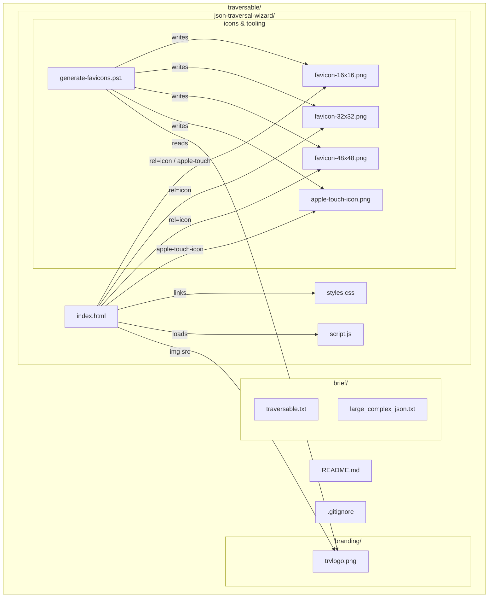
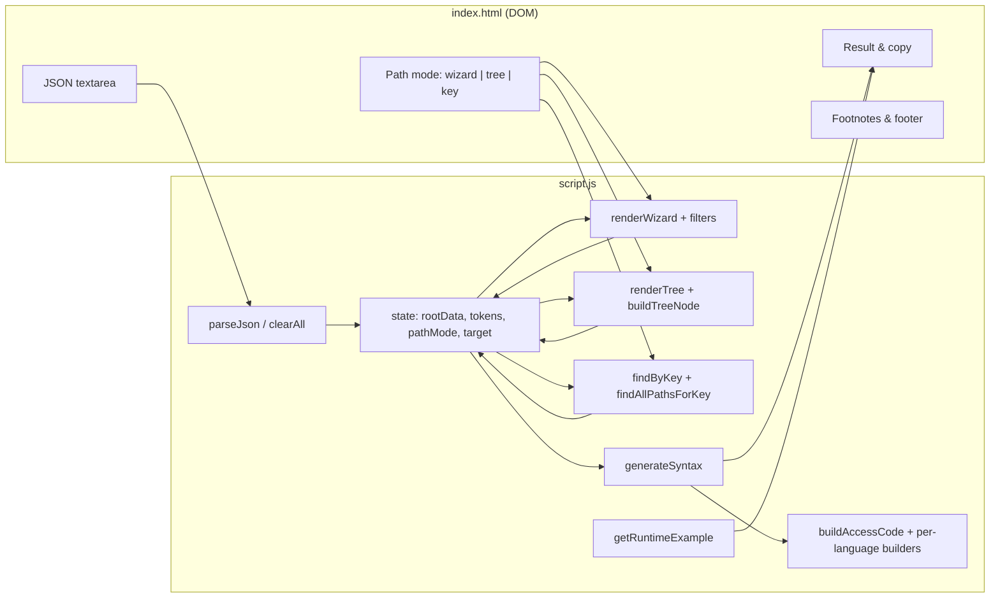
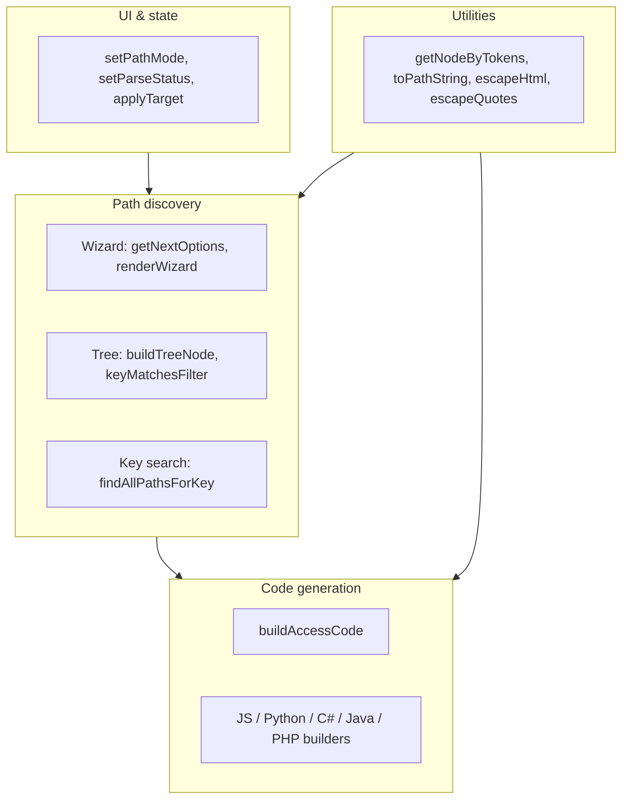

# Traversable — codebase architecture

Visual maps of the repository layout and how the browser app is structured. Diagrams use [Mermaid](https://mermaid.js.org/) (renders on GitHub, many Markdown previews, and [Mermaid Live Editor](https://mermaid.live/)).

---

## 1) Repository & file relationships

---

## 2) Runtime: page → script → user actions

---

## 3) `script.js` — main responsibility groups

---

## Summary

| Aspect | Detail |
|--------|--------|
| **Stack** | Static site: HTML + CSS + JS (no build step) |
| **Runtime** | Entirely in the browser; JSON never sent to a server |
| **App entry** | `json-traversal-wizard/index.html` |
| **`brief/`** | Notes / sample JSON (not loaded by the app) |
| **`branding/`** | Logo; source for favicons via `generate-favicons.ps1` |
